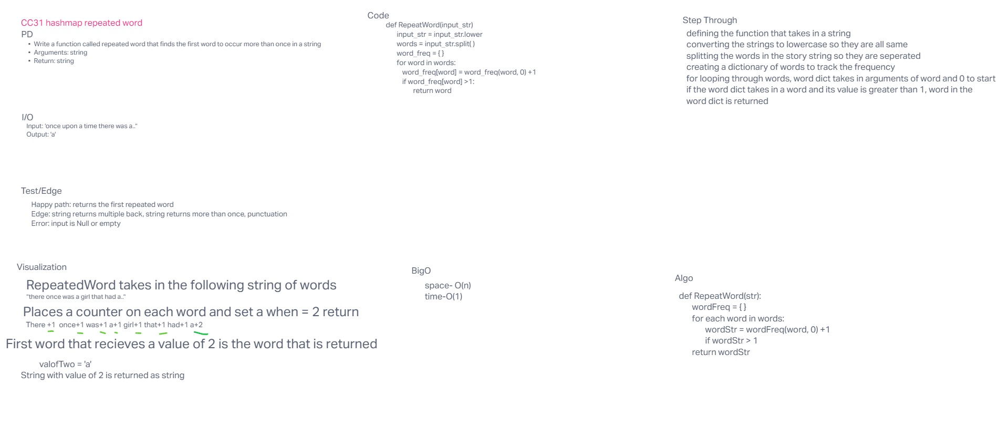

# Code Challenge 31

## Feature Tasks

- Write a function called repeated word that finds the first word to occur more than once in a string
- Arguments: string
- Return: string

## Whiteboard Process

## Contributions

Slava Makeev for a working hashmap.py file and Chatgpt for a different code than my failing code/ Regex pattern