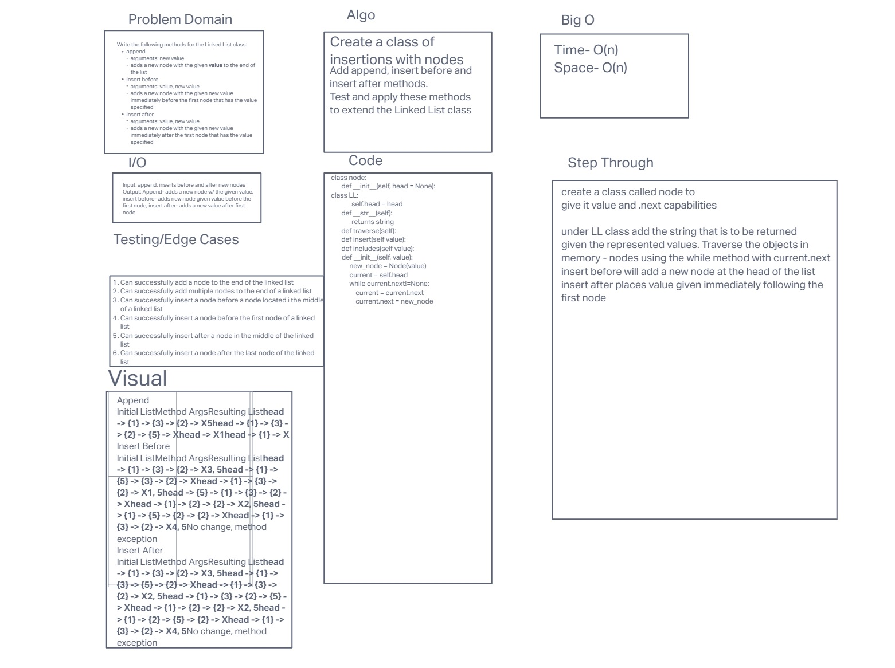

# Code Challenge 06

## Write the following methods for the Linked List class:

- append
arguments: new value
adds a new node with the given value to the end of the list
- insert before
arguments: value, new value
adds a new node with the given new value immediately before the first node that has the value specified
- insert after
arguments: value, new value
adds a new node with the given new value immediately after the first node that has the value specified

## Whiteboard Process
- 
<!-- Embedded whiteboard image -->

## Approach & Efficiency
<!-- What approach did you take? Why? What is the Big O space/time for this approach? -->

## Solution
<!-- Show how to run your code, and examples of it in action -->
## Contributions:
- Slava Makeev and Sarah Glass and ChatGPT

