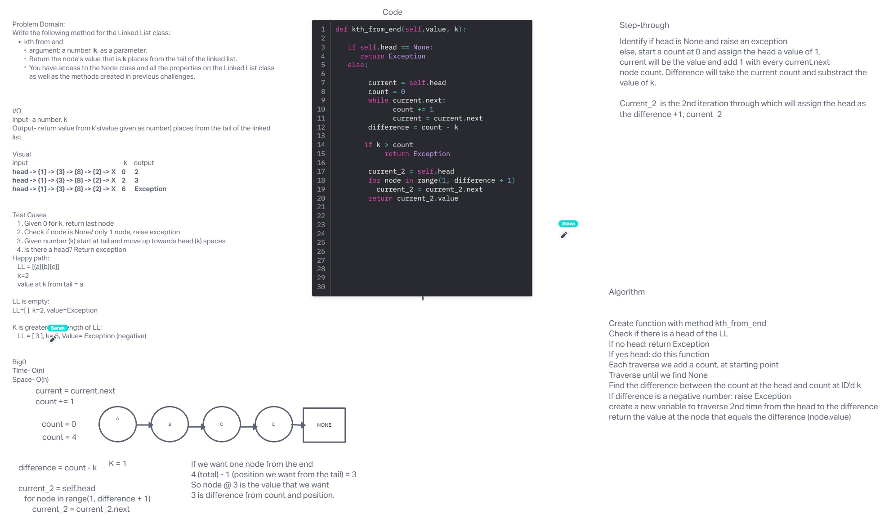

# Code Challenge 07

## Write the following methods for the Linked List class:

  - kth from end
      - argument: a number, `k`, as a parameter.
      - Return the node’s value that is `k` places from the tail of the       linked list.
      - You have access to the Node class and all the properties on the       Linked List class as well as the methods created in previous      challenges.

## Whiteboard Process
- 
<!-- Embedded whiteboard image -->

## Approach & Efficiency
Go through the LL twice and subtract the difference for where we determine the head of 1 is

## Solution

## Contributions:
- Slava Makeev and Sarah Glass and Anthony Sinitsa (Group 2)