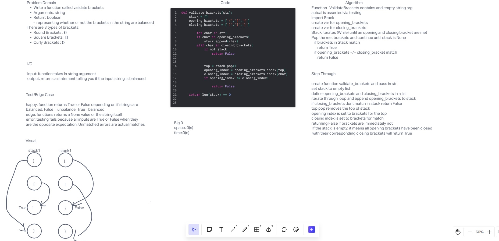

# Code Challenge 13

## Write the following methods for the Linked List class:

Write a function called validate brackets
Arguments: string
Return: boolean
representing whether or not the brackets in the string are balanced
There are 3 types of brackets:

Round Brackets : ()
Square Brackets : []
Curly Brackets : {}

## Whiteboard Process
- 
<!-- Embedded whiteboard image -->

## Approach & Efficiency

## Solution

## Contributions:
- Class of 401d22
- ChatGPT