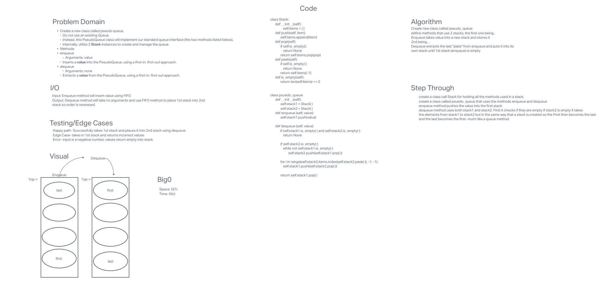

# Code Challenge 11

## Implement a Queue using two Stacks.

### Specifications
  Read all of these instructions carefully.
  Name things exactly as described.
  Do all your work in a your data-structures-and-algorithms public repository.
  Create a new branch in your repo named as noted below.
  Follow the language-specific instructions for the challenge type listed below.
  Update the “Table of Contents” - in the README at the root of the repository - with a link to this challenge’s README file.

### Feature Tasks
  Create a new class called pseudo queue.
    Do not use an existing Queue.
    Instead, this PseudoQueue class will implement our standard queue interface (the two methods listed below),
    Internally, utilize 2 Stack instances to create and manage the queue
  Methods:
    enqueue
      Arguments: value
      Inserts a value into the PseudoQueue, using a first-in, first-out approach.
    dequeue
      Arguments: none
      Extracts a value from the PseudoQueue, using a first-in, first-out approach.

## Whiteboard Process

<!-- Embedded whiteboard image -->

## Approach & Efficiency

## Solution

## Contributions:
  Class of 401d22, chatGPT probably (dont have the prompts)