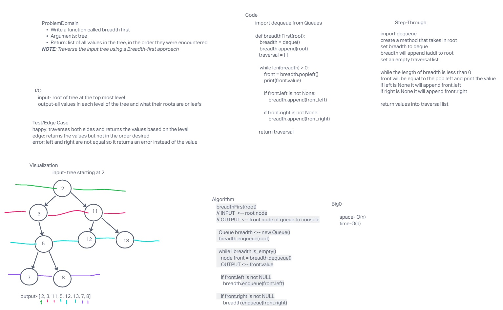

# Code Challenge 17

## Tree-Breadth-First

### Specifications
  Read all of these instructions carefully.
  Name things exactly as described.
  Do all your work in a your data-structures-and-algorithms public repository.
  Create a new branch in your repo named as noted below.
  Follow the language-specific instructions for the challenge type listed below.
  Update the “Table of Contents” - in the README at the root of the repository - with a link to this challenge’s README file.

### Feature Tasks
Write a function called breadth first
Arguments: tree
Return: list of all values in the tree, in the order they were encountered
NOTE: Traverse the input tree using a Breadth-first approach
## Whiteboard Process

<!-- Embedded whiteboard image -->

## Approach & Efficiency

## Solution

## Contributions:
  Class of 401d22