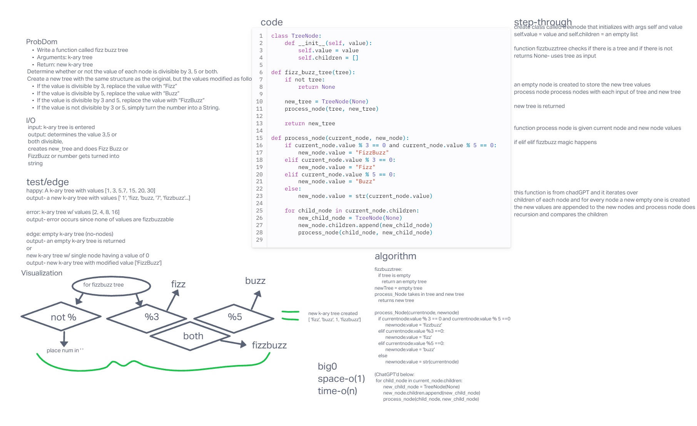

# Code Challenge 18

## Tree-Fizz-Buzz

### Specifications
  Read all of these instructions carefully.
  Name things exactly as described.
  Do all your work in a your data-structures-and-algorithms public repository.
  Create a new branch in your repo named as noted below.
  Follow the language-specific instructions for the challenge type listed below.
  Update the “Table of Contents” - in the README at the root of the repository - with a link to this challenge’s README file.

### Feature Tasks
Write a function called fizz buzz tree
Arguments: k-ary tree
Return: new k-ary tree
Determine whether or not the value of each node is divisible by 3, 5 or both. Create a new tree with the same structure as the original, but the values modified as follows:

If the value is divisible by 3, replace the value with “Fizz”
If the value is divisible by 5, replace the value with “Buzz”
If the value is divisible by 3 and 5, replace the value with “FizzBuzz”
If the value is not divisible by 3 or 5, simply turn the number into a String.
## Whiteboard Process

<!-- Embedded whiteboard image -->

## Approach & Efficiency

## Solution

## Contributions:
  Class of 401d22