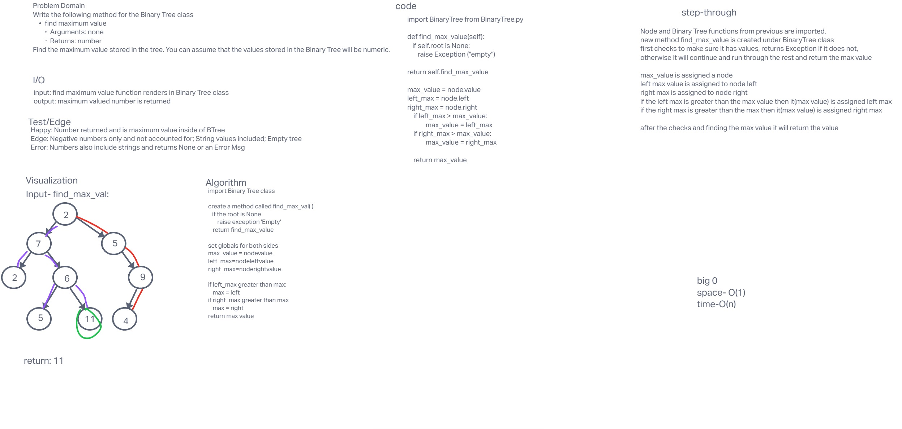

# Code Challenge 16

## Tree-Max

### Specifications
  Read all of these instructions carefully.
  Name things exactly as described.
  Do all your work in a your data-structures-and-algorithms public repository.
  Create a new branch in your repo named as noted below.
  Follow the language-specific instructions for the challenge type listed below.
  Update the “Table of Contents” - in the README at the root of the repository - with a link to this challenge’s README file.

### Feature Tasks
- Write the following method for the Binary Tree class
    find maximum value
    Arguments: none
    Returns: number
    Find the maximum value stored in the tree. You can assume that the values stored    in the Binary Tree will be numeric.
## Whiteboard Process

<!-- Embedded whiteboard image -->

## Approach & Efficiency

## Solution

## Contributions:
  Class of 401d22, ChatGPT prompt: here is my code: gave it binary_tree.py and the same code as my whiteboard code and added - "write me a helper function to make this work"