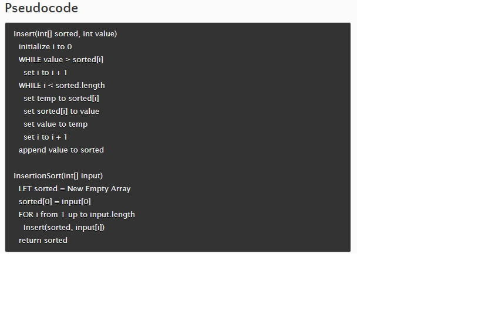

# Blog Notes: Insertion Sort

## Code Challenge 26
Review the pseudocode below, then trace the algorithm by stepping through the process with the provided sample array. Document your explanation by creating a blog article that shows the step-by-step output after each iteration through some sort of visual.

Once you are done with your article, code a working, tested implementation of Insertion Sort based on the pseudocode provided.

## Whiteboard Process
blog article

## Blog

Step-by-Step Process of Insertion Sort

1. Initial State

input array: [5, 2, 9, 1, 5, 6]
sorted array: []
2. First Iteration (Insert 5)

input array: [5, 2, 9, 1, 5, 6]
sorted array: [5]
Explanation: The first element of the input array (5) is placed in the sorted array since it is the only element.
3. Second Iteration (Insert 2)

input array: [5, 2, 9, 1, 5, 6]
sorted array: [2, 5]
Explanation: The second element of the input array (2) is compared with the elements in the sorted array (5). As 2 is smaller than 5, it is inserted before 5, resulting in [2, 5].
4. Third Iteration (Insert 9)

input array: [5, 2, 9, 1, 5, 6]
sorted array: [2, 5, 9]
Explanation: The third element of the input array (9) is compared with the elements in the sorted array (2, 5). As 9 is greater than 5, it is inserted after 5, resulting in [2, 5, 9].
5. Fourth Iteration (Insert 1)

input array: [5, 2, 9, 1, 5, 6]
sorted array: [1, 2, 5, 9]
Explanation: The fourth element of the input array (1) is compared with the elements in the sorted array (2, 5, 9). As 1 is smaller than 2, it is inserted before 2, resulting in [1, 2, 5, 9].
6. Fifth Iteration (Insert 5)

input array: [5, 2, 9, 1, 5, 6]
sorted array: [1, 2, 5, 5, 9]
Explanation: The fifth element of the input array (5) is compared with the elements in the sorted array (1, 2, 5, 9). As 5 is equal to 5, it is inserted after the first 5, resulting in [1, 2, 5, 5, 9].
7. Sixth Iteration (Insert 6)

input array: [5, 2, 9, 1, 5, 6]
sorted array: [1, 2, 5, 5, 6, 9]
Explanation: The sixth element of the input array (6) is compared with the elements in the sorted array (1, 2, 5, 5, 9). As 6 is greater than 5 and less than 9, it is inserted between 5 and 9, resulting in [1, 2, 5, 5, 6, 9].

## Approach & Efficiency
Big0-Space:O(n)
Time:O(1)

## Solution
[sorting/insertion/insertion.py](sorting/insertion/insertion.py)