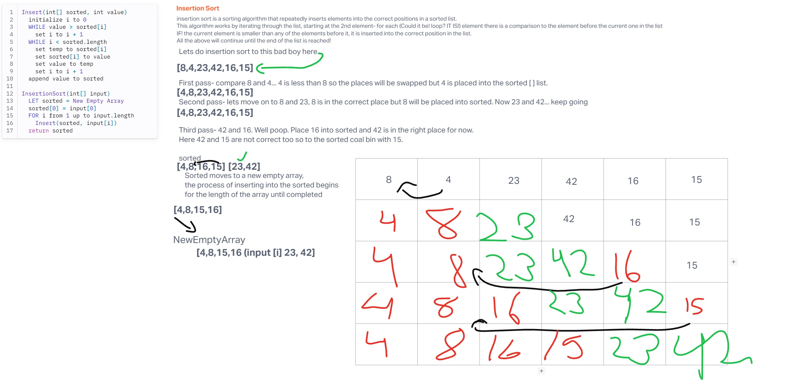

# Blog Notes: Insertion Sort

## Code Challenge 26
Review the pseudocode below, then trace the algorithm by stepping through the process with the provided sample array. Document your explanation by creating a blog article that shows the step-by-step output after each iteration through some sort of visual.

Once you are done with your article, code a working, tested implementation of Insertion Sort based on the pseudocode provided.

## Whiteboard Process

## Approach & Efficiency
Big0-Space:O(n)
Time:O(1)

## Solution
[sorting/insertion/insertion.py](sorting/insertion/insertion.py)