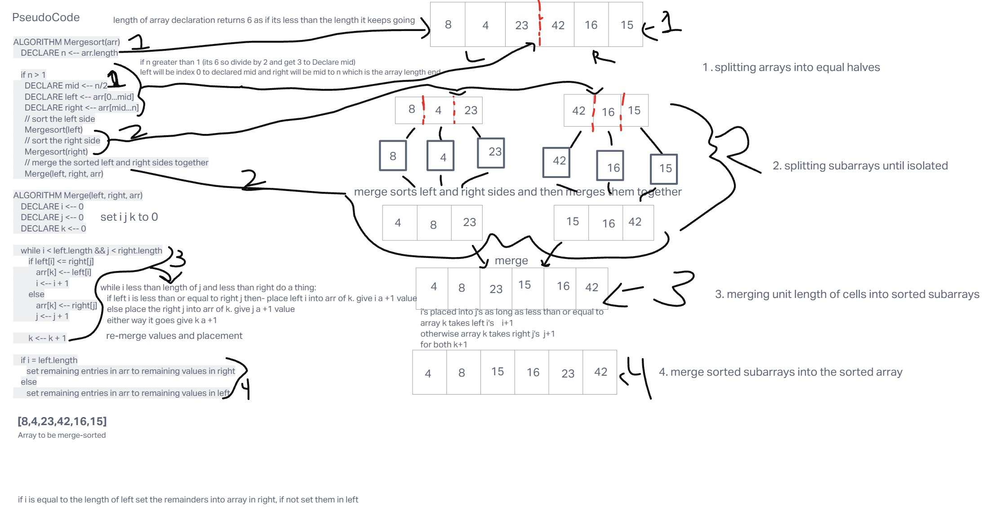

# Blog Notes: Merge Sort

## Code Challenge 27
Using the following pseudocode create a blog post and also include the following input array [8,4,23,42,16,15]
      ALGORITHM Mergesort(arr)
          DECLARE n <-- arr.length

          if n > 1
            DECLARE mid <-- n/2
            DECLARE left <-- arr[0...mid]
            DECLARE right <-- arr[mid...n]
            // sort the left side
            Mergesort(left)
            // sort the right side
            Mergesort(right)
            // merge the sorted left and right sides together
            Merge(left, right, arr)

      ALGORITHM Merge(left, right, arr)
          DECLARE i <-- 0
          DECLARE j <-- 0
          DECLARE k <-- 0

          while i < left.length && j < right.length
              if left[i] <= right[j]
                  arr[k] <-- left[i]
                  i <-- i + 1
              else
                  arr[k] <-- right[j]
                  j <-- j + 1

              k <-- k + 1

          if i = left.length
             set remaining entries in arr to remaining values in right
          else
             set remaining entries in arr to remaining values in left
## Whiteboard Process

## Approach & Efficiency
Big0
- Space: O(n)
- Time: O(n log (n))

## Solution
[sorting/merge/merge_sort.py](sorting/merge/merge_sort.py)

### Contributions
super amazing awesome explanation and code for this process found here [https://www.geeksforgeeks.org/merge-sort/](https://www.geeksforgeeks.org/merge-sort/)